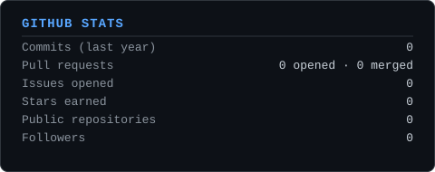
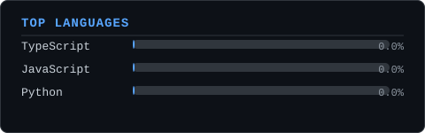

# SPARSH SHARMA

**Backend Software Engineer · Full-Stack Developer**

Designing APIs, distributed systems, realtime applications, and AI-powered products.

`AVAILABLE FOR OPPORTUNITIES` · `DELHI / NCR`

[LinkedIn](https://linkedin.com/in/your-linkedin) · [GitHub](https://github.com/your-username) · [Portfolio](https://your-portfolio.dev) · [Email](mailto:sparshs730@gmail.com)

 

## ENGINEERING FOCUS

<table>
<tr>
<td width="50%" valign="top">

**`01`  BACKEND**
 
APIs · Data · Transactions · Background Jobs

</td>
<td width="50%" valign="top">

**`02`  DISTRIBUTED**
 
Events · Queues · Caching · Concurrency

</td>
</tr>
<tr>
<td width="50%" valign="top">

**`03`  REALTIME**
 
WebSockets · Pub/Sub · Socket.IO

</td>
<td width="50%" valign="top">

**`04`  AI**
 
LLM Workflows · Structured Generation · AI Products

</td>
</tr>
</table>

 

## TECHNOLOGY STACK

<table>
<tr><td width="140"><b>Languages</b></td><td>

</td></tr>
<tr><td><b>Backend</b></td><td>

</td></tr>
<tr><td><b>Data</b></td><td>

</td></tr>
<tr><td><b>Distributed / Realtime</b></td><td>

</td></tr>
<tr><td><b>Infrastructure</b></td><td>

</td></tr>
<tr><td><b>Testing / Observability</b></td><td>

</td></tr>
<tr><td><b>Frontend</b></td><td>

</td></tr>
</table>

 

## SELECTED WORK

### `01`&nbsp;&nbsp; DISTRIBUTED COMMERCE

Event-driven ecommerce platform built around transactional correctness — asynchronous processing, concurrency-safe inventory, payments, and search across a typed service boundary.

`EVENT-DRIVEN`&nbsp;&nbsp;`IDEMPOTENCY`&nbsp;&nbsp;`CONCURRENCY`

TypeScript · Fastify · PostgreSQL · Redis · BullMQ · Docker

**[Repository →](https://github.com/your-username/scalable-ecommerce-platform)**

4-service TypeScript monorepo · typed domain events driving 8+ idempotent BullMQ queues with retry/dead-letter handling · Redis distributed locks + PostgreSQL conditional transactions for oversell-safe inventory · JWT with rotating refresh tokens, RBAC · Stripe Checkout with signed webhooks

---

### `02`&nbsp;&nbsp; REALTIME GOLF

Production-oriented subscription platform combining realtime communication, asynchronous billing, and operational tooling across four independently scalable runtimes.

`REALTIME`&nbsp;&nbsp;`PUB/SUB`&nbsp;&nbsp;`WEBHOOKS`

Next.js · Redis · Socket.IO · BullMQ · Stripe · Razorpay

**[Repository →](https://github.com/your-username/golf-charity-platform)**

Standalone Socket.IO runtime with authenticated rooms, Redis Adapter, and Redis Pub/Sub for horizontal scale · BullMQ workers for billing, draws, analytics, and leaderboards · Stripe/Razorpay webhook processing with HMAC verification and idempotent, replay-safe reconciliation · Prometheus + Grafana observability

---

### `03`&nbsp;&nbsp; CODENOTES

AI-powered study platform built around reliable structured generation, transactional persistence, and production-oriented observability.

`AI GENERATION`&nbsp;&nbsp;`TRANSACTIONS`&nbsp;&nbsp;`OBSERVABILITY`

Next.js · PostgreSQL · Gemini 2.5 Flash · Vitest · Prometheus

**[Repository →](https://github.com/your-username/codenotes)**

Parallel transcript/title fetching with direct-video Gemini fallback · Schema-enforced JSON generation with `Idempotency-Key` handling, stale-request reclaim, and atomic PostgreSQL persistence · Structured JSON logging, request IDs, Prometheus metrics, health checks, TLS-verified DB connections, GitHub Actions CI

 

## MORE PROJECTS

<table>
<tr>
<td width="33%" valign="top">

**`04`  AI PROJECT COLLABORATOR**

Realtime collaboration · WebContainers · Gemini

`REALTIME COLLABORATION` · `AI CODEGEN` · `BROWSER SANDBOX`

**[Repository →](https://github.com/your-username/ai-project-collaborator)**

</td>
<td width="33%" valign="top">

**`05`  STOCK SCREENER**

Live small-cap market screener

`MARKET DATA` · `WEBSOCKETS` · `REALTIME STREAMING`

**[Repository →](https://github.com/your-username/real-time-stock-screener)**

</td>
<td width="33%" valign="top">

**`06`  MULTIMODAL AI**

Chest X-ray disease classification research

`MULTIMODAL AI` · `CNN/MLP` · `GRAD-CAM`

**[Repository →](https://github.com/your-username/multimodal-disease-classification)**

</td>
</tr>
</table>

 

## GITHUB ACTIVITY

<table>
<tr>
<td width="50%"></td>
<td width="50%"></td>
</tr>
</table>

`stats.svg` and `top-langs.svg` are static assets generated and committed by this repository's own GitHub Actions workflow — see `SETUP.md` for how it works.

 

## RESEARCH

`IEEE PUBLISHED`

**Multimodal Deep Learning for Chest X-Ray Disease Classification**

IEEE-published research on multimodal CNN/MLP fusion for chest disease classification and model explainability.

PyTorch · CNN/MLP · Multimodal Learning · Grad-CAM

**[Publication →](https://github.com/your-username/multimodal-disease-classification)** (replace with the IEEE DOI/Xplore link)

 

## CURRENTLY EXPLORING

Distributed Systems · System Design · Backend Performance · Reliability Engineering

 

---

### BUILD SOMETHING INTERESTING?

[LinkedIn](https://linkedin.com/in/your-linkedin) · [GitHub](https://github.com/your-username) · [Portfolio](https://your-portfolio.dev) · [Email](mailto:sparshs730@gmail.com)

